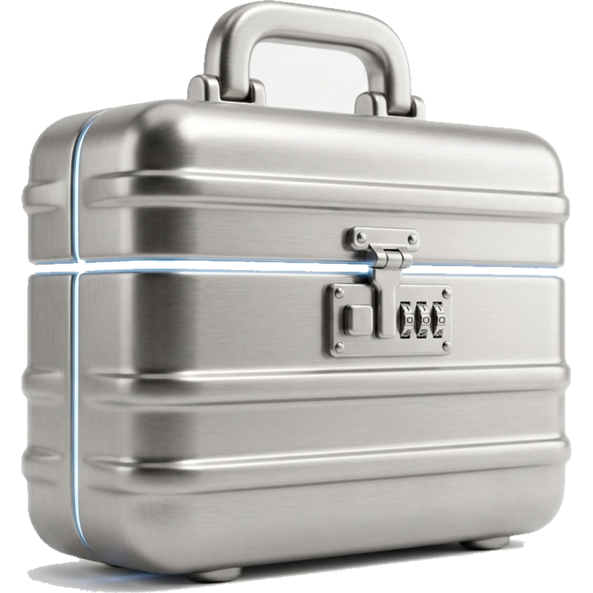
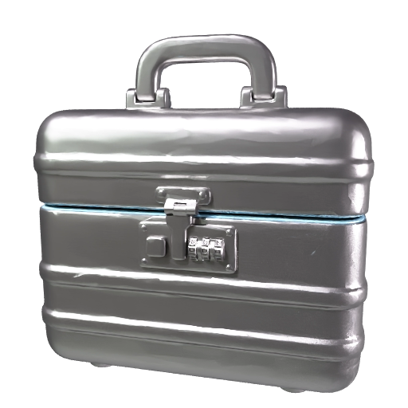
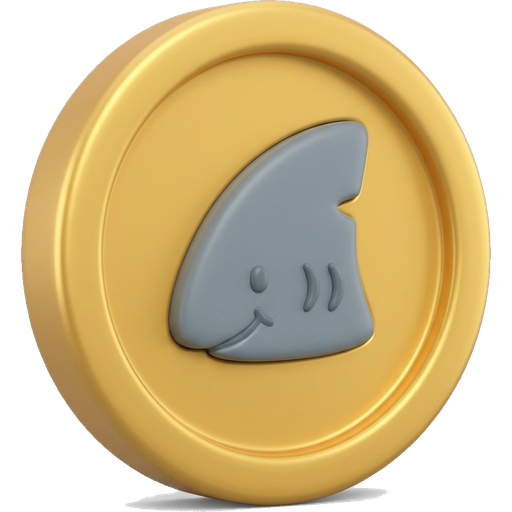
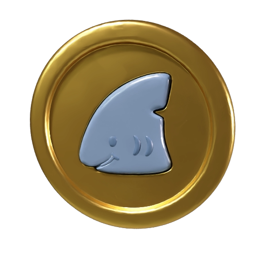
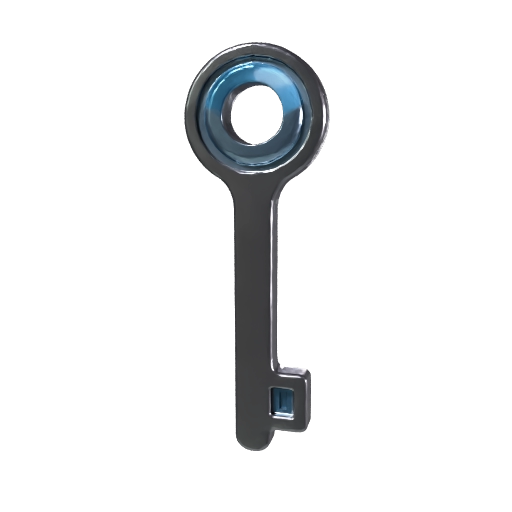
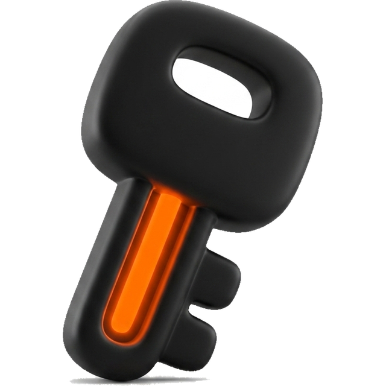

# Briefcase 3-D models — review gallery

Every GLB the reward loop renders, as Meshy rendered it. Generated by `scripts/generate-briefcase-models.mjs` from `assets-src/briefcase/models.json`; the served files are `public/briefcase/models/<slug>-v<version>.glb` after `npm run models`. Provenance (route, model, task ids, credits) is `assets-src/briefcase/models/provenance.json`.

| Slug | Name | v | Route | Model | Credits | Lifted from | Meshy render |
|---|---|---|---|---|---|---|---|
| `t1-canvas` | Canvas Case | 2 | image | latest | 30 |  |  |
| `t2-leather` | Leather Attaché | 2 | image | latest | 30 |  |  |
| `t3-titanium` | Titanium Case | 2 | image | latest | 30 |  |  |
| `t4-obsidian` | Obsidian Executive | 2 | text | latest | 30 | text prompt |  |
| `t5-gold` | Gold Briefcase | 2 | image | latest | 30 |  |  |
| `shark-token` | Shark Token | 2 | image | latest | 30 |  |  |
| `key-t1` | Canvas Key | 1 | image | latest | 30 |  |  |
| `key-t2` | Leather Key | 1 | image | latest | 30 |  |  |
| `key-t3` | Titanium Key | 1 | text | latest | 30 | text prompt |  |
| `key-t4` | Obsidian Key | 1 | image | latest | 30 |  |  |
| `key-t5` | Gold Key | 1 | image | latest | 30 |  |  |

Regenerate one: `npm run art:models -- generate --only <slug> --force`, then `install`, then `npm run models`, and bump its `version` in models.json + `lib/rewards/models.ts` so the served name changes.
