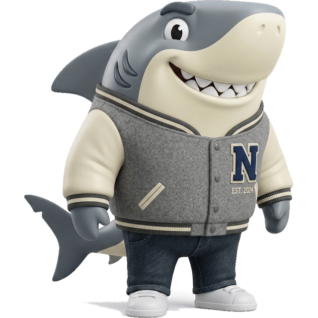
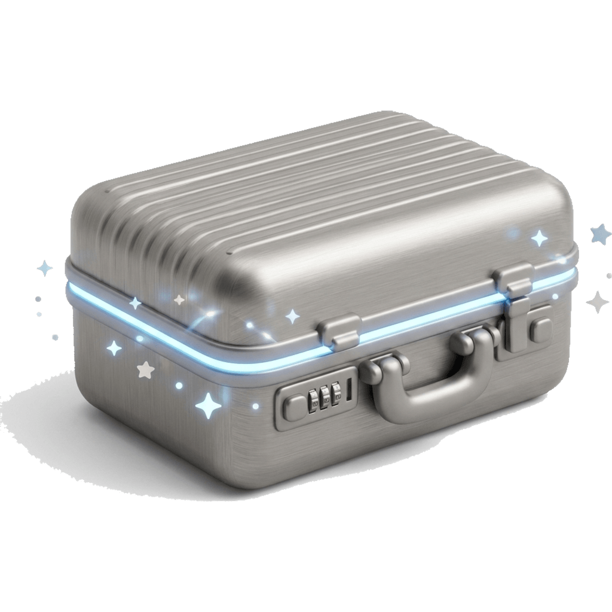
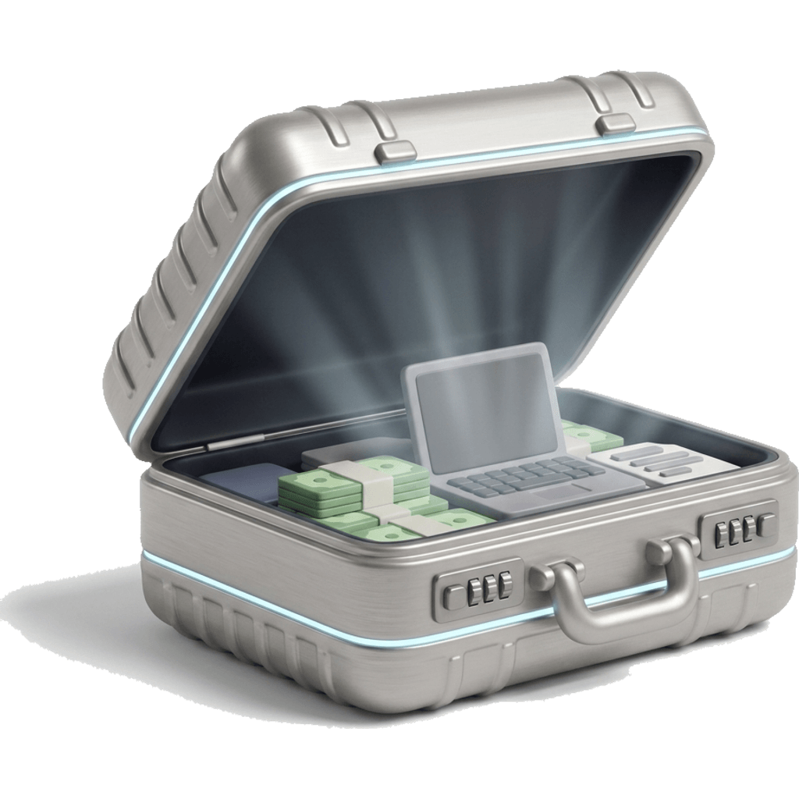
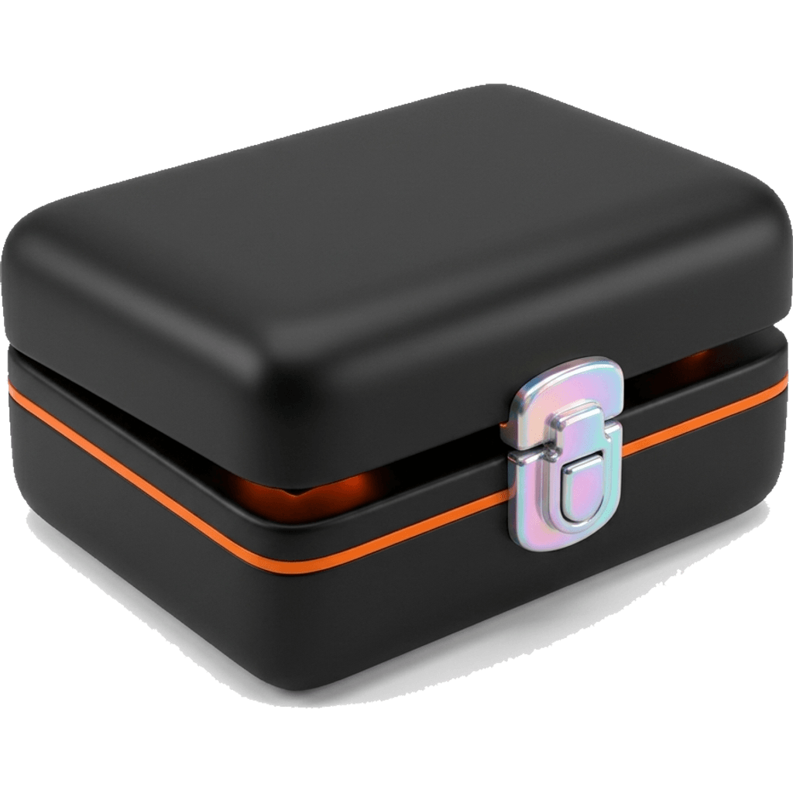
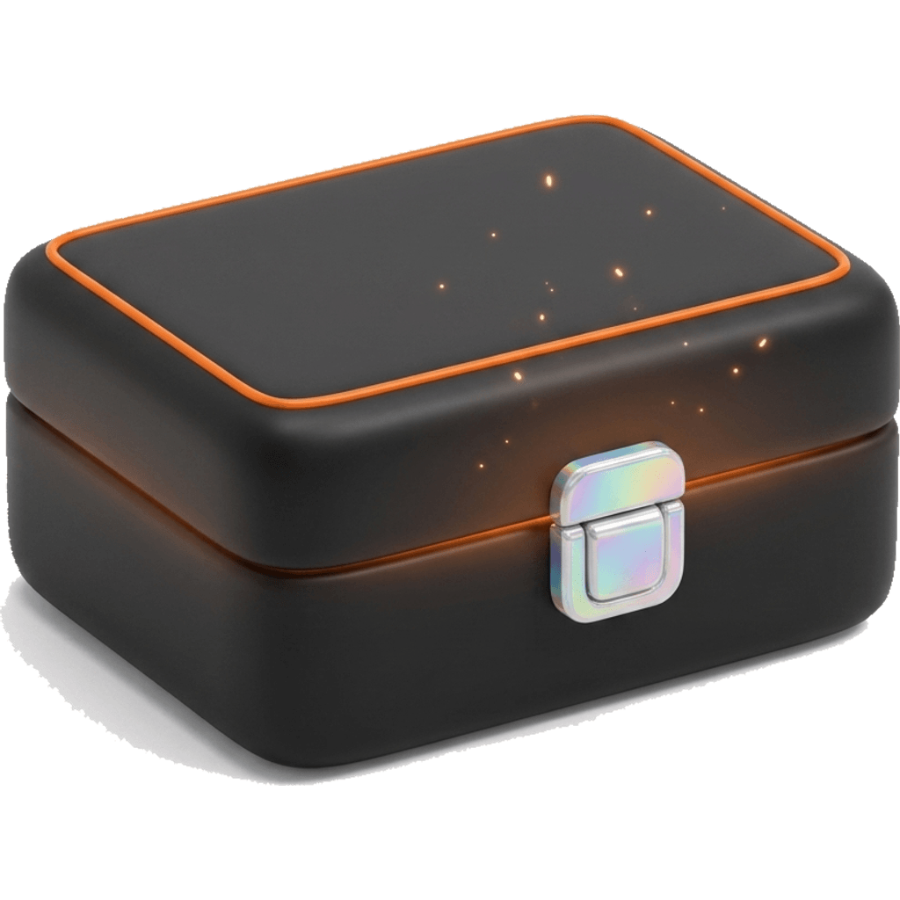
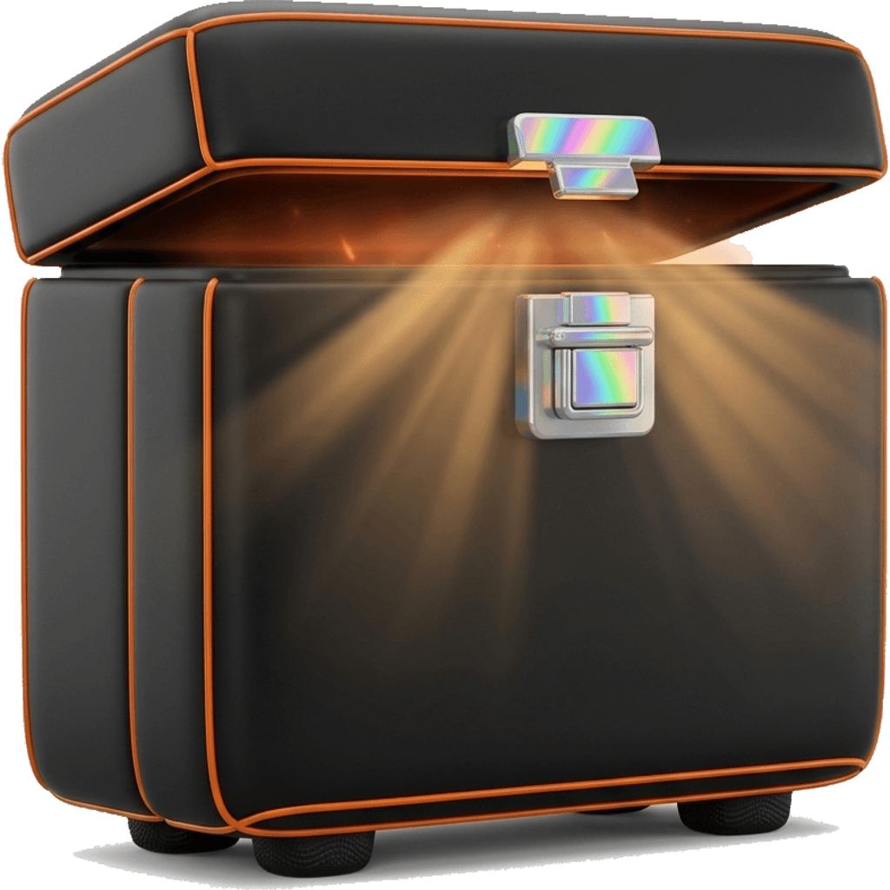
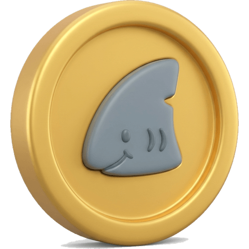
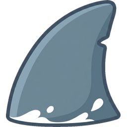
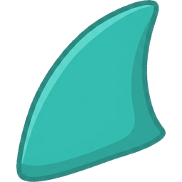

# Briefcase art — review gallery

Every asset the generator produced, straight from `public/briefcase/` (style `v1`). Nothing here is wired into the game yet — this page exists to be judged.

Both founders are sharks from the panel cast: **Novus** (masc) and **Nova** (fem). Each design renders on both. For an interactive version with dark/light/checker grounds and tier filters, run the app and open `/admin/assets`.

**170** skin renders · **18** case states · **5** keys · **8** props · **11** FX sprites


## Garage Days

| # | Name | Tier | Novus | Nova |
|---|---|---|---|---|
| 001 | Day One Hoodie | T1 common |  |  |
| 002 | Ship It Tee | T1 common |  |  |
| 003 | Garage Flannel | T1 common |  |  |
| 004 | Campus Crew | T1 common |  |  |
| 005 | Denim Dreamer | T1 common |  |  |
| 006 | Cap & Grind | T1 common |  |  |
| 007 | Cargo Builder | T1 common |  |  |
| 008 | Trailhead Vest | T1 common |  |  |
| 009 | Track Startup | T1 common |  |  |
| 010 | Crunch Time PJs | T1 common |  |  |

## First Office

| # | Name | Tier | Novus | Nova |
|---|---|---|---|---|
| 011 | First Desk | T1 common |  |  |
| 012 | Quiet Analyst | T1 common |  |  |
| 013 | Casual Friday | T1 common |  |  |
| 014 | Ivy Intern | T1 common |  |  |
| 015 | Client Ready | T1 common |  |  |
| 016 | Commuter | T1 common |  |  |
| 017 | Soft Launch | T2 uncommon |  |  |
| 018 | Deal Desk | T2 uncommon |  |  |
| 019 | Junior Partner | T2 uncommon | — | — |
| 020 | Monochrome Minimal | T2 uncommon |  |  |

## Corporate Ladder

| # | Name | Tier | Novus | Nova |
|---|---|---|---|---|
| 021 | The Standard | T2 uncommon |  |  |
| 022 | Boardroom Charcoal | T2 uncommon |  | — |
| 023 | The Closer | T2 uncommon |  | — |
| 024 | Portfolio Check | T2 uncommon |  | — |
| 025 | Managing Director | T2 uncommon |  |  |
| 026 | Old Reliable | T2 uncommon |  | — |
| 027 | Modern Exec | T2 uncommon |  |  |
| 028 | Quarterly Review | T2 uncommon |  |  |
| 029 | Power Move | T3 rare | — | — |
| 030 | White Collar | T3 rare |  |  |

## Street CEO

| # | Name | Tier | Novus | Nova |
|---|---|---|---|---|
| 031 | Block Founder | T1 common |  |  |
| 032 | Drop Day | T1 common |  |  |
| 033 | Bucket List | T1 common |  |  |
| 034 | Heat Check | T1 common |  |  |
| 035 | Letterman | T1 common |  |  |
| 036 | Deck Check | T1 common |  |  |
| 037 | Ghost Mode | T2 uncommon |  |  |
| 038 | Winter Hustle | T2 uncommon |  |  |
| 039 | Self Made | T2 uncommon |  |  |
| 040 | Camo Ops | T2 uncommon |  |  |

## Retro Business

| # | Name | Tier | Novus | Nova |
|---|---|---|---|---|
| 041 | Mad Avenue '62 | T2 uncommon |  | — |
| 042 | Groovy Ledger '74 | T2 uncommon |  | — |
| 043 | Fax & Facts '95 | T2 uncommon |  |  |
| 044 | Typewriter Tycoon | T2 uncommon |  |  |
| 045 | Wall Street '87 | T2 uncommon |  | — |
| 046 | Dot-Com Y2K | T3 rare |  |  |
| 047 | Gatsby Gains | T3 rare |  |  |
| 048 | The Negotiator | T3 rare | — |  |
| 049 | Profit Fever | T3 rare |  |  |
| 050 | Steam Baron | T3 rare |  |  |

## Tech Visionary

| # | Name | Tier | Novus | Nova |
|---|---|---|---|---|
| 051 | Keynote | T2 uncommon |  | — |
| 052 | Move Fast | T2 uncommon |  |  |
| 053 | Server Room | T2 uncommon |  |  |
| 054 | Augmented | T2 uncommon |  |  |
| 055 | Prototype | T3 rare |  |  |
| 056 | Orbit | T3 rare |  | — |
| 057 | Neon Founder | T3 rare |  | — |
| 058 | Circuit Blazer | T3 rare |  |  |
| 059 | Hologram | T4 epic |  |  |
| 060 | Mech Mode | T4 epic |  |  |

## World Tour Tailoring

| # | Name | Tier | Novus | Nova |
|---|---|---|---|---|
| 061 | Milano Sartoria | T3 rare |  |  |
| 062 | Ginza Minimal | T3 rare |  |  |
| 063 | Seoul Avant | T3 rare |  | — |
| 064 | Madison Ave | T3 rare |  |  |
| 065 | Mumbai Bandhgala | T3 rare | — | — |
| 066 | Savile Row | T4 epic |  | — |
| 067 | Paris Atelier | T4 epic | — |  |
| 068 | Shanghai Modern | T4 epic | — |  |
| 069 | Lagos Agbada | T4 epic |  |  |
| 070 | Dubai Gold Line | T4 epic | — |  |

## Industry Pro

| # | Name | Tier | Novus | Nova |
|---|---|---|---|---|
| 071 | Line Cook | T1 common |  |  |
| 072 | On Call | T1 common |  |  |
| 073 | Captain | T1 common |  |  |
| 074 | Grease & Gears | T1 common |  |  |
| 075 | Barista Craft | T1 common |  |  |
| 076 | Last Mile | T1 common |  |  |
| 077 | Site Boss | T1 common |  |  |
| 078 | Shop Floor | T1 common |  |  |
| 079 | Executive Chef | T3 rare |  |  |
| 080 | Chief of Surgery | T3 rare |  | — |

## Seasonal & Events

| # | Name | Tier | Novus | Nova |
|---|---|---|---|---|
| 081 | Commencement | T3 rare |  |  |
| 082 | Offsite Linen | T3 rare |  |  |
| 083 | Fortune Founder | T4 epic |  |  |
| 084 | Snowline Gala | T4 epic | — |  |
| 085 | Vampire VC | T4 epic |  |  |
| 086 | Confetti Closer | T4 epic |  |  |
| 087 | Founding Day | T4 epic |  | — |
| 088 | Midnight NYE | T4 epic |  |  |
| 089 | Lantern Festival | T4 epic |  |  |
| 090 | Beach Board Meeting | T4 epic |  |  |

## Legendary Founders

| # | Name | Tier | Novus | Nova |
|---|---|---|---|---|
| 091 | The Gold Standard | T5 legendary |  |  |
| 092 | Diamond Hands | T5 legendary |  |  |
| 093 | The Apex | T5 legendary | — |  |
| 094 | Midas Touch | T5 legendary |  |  |
| 095 | Astro Founder | T5 legendary |  |  |
| 096 | The Chairman | T5 legendary | — |  |
| 097 | Phoenix Clause | T5 legendary | — | — |
| 098 | Ghost Equity | T5 legendary |  |  |
| 099 | Prism Legacy | T5 legendary |  | — |
| 100 | The Magnate | T5 legendary | — | — |

## Milestone only

| # | Name | Tier | Novus | Nova |
|---|---|---|---|---|
| 101 | Perennial | T4 epic |  |  |

## Briefcases

| Case | Tier | Closed | Glow | Open |
|---|---|---|---|---|
| Canvas Case | T1 |  |  |  |
| Leather Attaché | T2 |  |  |  |
| Titanium Case | T3 |  |  |  |
| Obsidian Executive | T4 |  |  |  |
| Gold Briefcase | T5 |  |  |  |
| Denim Canvas (reskin) | T1 |  |  |  |

## Keys

| T1 | T2 | T3 | T4 | T5 |
|---|---|---|---|---|
|  |  |  |  |  |

## Props

| Asset | Kind | Art |
|---|---|---|
| Shark Token | object |  |
| Bronze Ledger | frame |  |
| Silver Portfolio | frame |  |
| Gold Boardroom | frame |  |
| Molten Gold | frame |  |
| Skyline Corner Office | background |  |
| Trophy Lift (Novus) | pose |  |
| Trophy Lift (Nova) | pose |  |

## FX sprites


**Paper Cash** (`confetti-paper-cash`)

| confetti-cash-1 | confetti-cash-2 | confetti-cash-3 |
|---|---|---|
|  |  |  |

**Shark Fins** (`confetti-shark-fins`)

| confetti-fin-1 | confetti-fin-2 | confetti-fin-3 |
|---|---|---|
|  |  |  |

**Gold Trophies** (`confetti-gold-trophies`)

| confetti-trophy-1 | confetti-trophy-2 | confetti-trophy-3 |
|---|---|---|
|  |  |  |

**Orange Spark** (`cursor-trail`)

| cursor-orange-spark |
|---|
|  |

**Founder's Seal** (`aura`)

| aura-founders-seal |
|---|
|  |

## Still to generate (32)

```
019_novus 019_nova 022_nova 023_nova 024_nova 026_nova 029_novus 029_nova 041_nova 042_nova 045_nova 048_novus 051_nova 056_nova 057_nova 063_nova 065_novus 065_nova 066_nova 067_novus 068_novus 070_novus 080_nova 084_novus 087_nova 093_novus 096_novus 097_novus 097_nova 099_nova 100_novus 100_nova
```

Re-run the generator and it picks up exactly these — finished renders are never redone:

```sh
npm run art:briefcase -- all --model gemini-3.1-flash-image --concurrency 4
```


---

_Generated by `scripts/build-briefcase-art.mjs`. See `docs/BRIEFCASE-ART.md` for the pipeline._
